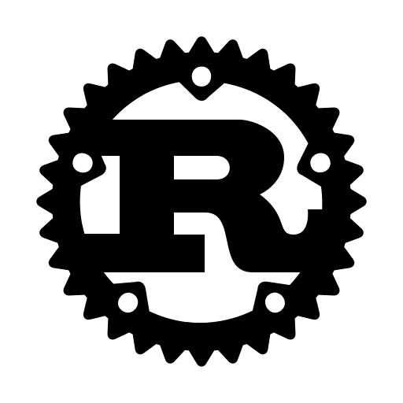

# Raw-MQTT

Simple Rust MQTT client library and tools supporting TCP, TLS and QUIC transport layers. 

---

## Structure
The repository is structured as follows:
- [raw-mqtt-lib](raw-mqtt-lib) - The main library crate
- [raw-mqtt-cli](raw-mqtt-cli) - A simple command line client tool
- [raw-mqtt-stream-cli](raw-mqtt-stream-cli) - A simple command line client tool for streaming requests

---

## Dependencies
|                        |     Crate      |      Version       |                                                  Documentation                                                   |        Notes         |
|:----------------------:|:--------------:|:------------------:|:----------------------------------------------------------------------------------------------------------------:|:--------------------:|
|  Asynchronous Runtime  |     tokio      |       1.35.1       |                |          -           |
|          Quic          |     quinn      |       0.10.2       |                |   Based on rustls    |
|          Tls           |  tokio-rustls  |       0.25.0       |  |   Based on rustls    |

---

## TODO
 - Subscribe operation
 - Client authentication
 - Protocol version 3.1 and 5
 - QoS 2
 - Keep alive mechanism
 - Pretty error messages
---

## Known Issues
- Quic transport protocol is not compatible with EMQX broker
---

